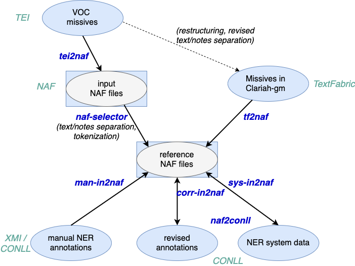

# VOC missives

This repository provides code for Named Entity Recognition on the VOC [Generale Missiven](http://resources.huygens.knaw.nl/vocgeneralemissiven) 
 for [Clariah WP6](https://www.clariah.nl/en/work-packages/focus-areas/text?layout=blog).

Preprocessing involves converting TEI input missives to NAF NLP format,
and handling the integration of manual and system NER annotations. 

## Overview
The repository consists of three parts:
* code for the conversion of the missives between different [formats](#formats) 
* code for missive extraction from [TextFabric](tf/README.md)
* code for [NER](ner/README.md) experiments 

### Formats
The code offers the following functions:
 
 * `tei2naf`: conversion of missives in TEI format to input NAF files
 * `naf-selector`: derivation of reference NAF files for NLP processing 
 by selection of *text* or *note* text units from input NAF files
 * `man-in2naf`: integration of manually-annotated entities in XMI or Conll format 
 into reference NAF files 
 * `naf2conll`: conversion of reference NAF files to Conll
 * `sys-in2naf`: integration of system NER entities in Conll format into reference 
 NAF files
 
 

See [Functions](docs/functions.md) for a description of each function. 

NAF is used as an internal format throughout, but we distinguish *input* NAF files, which closely follow the structure 
of the TEI missives, from *reference* NAF files that are oriented towards NLP processing.
See [Input and Reference NAF files](docs/in-ref-naf.md) for more information.

This part of the code is in Java, see the [Installation](docs/install.md) instructions to compile the code and build an executable jar for the project.
This jar appears as `gm-processor-*-jar-with-dependencies.jar` in `./target`.

With the executable jar, you can use the scripts located in `./scripts` to run the different functions.
The scripts and command-line arguments to the `jar` are documented in [Usage](docs/usage.md).

