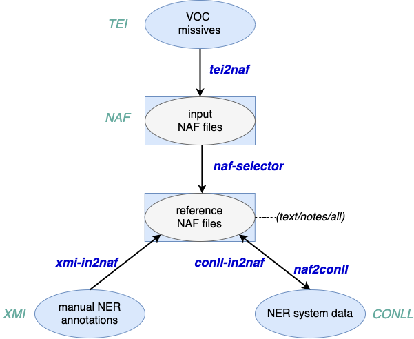

# Formats and conversion functions
The code offers a variety of conversion scripts for different stages of processing in the missives. 
We use [NAF](https://github.com/newsreader/NAF) as a central format, as it allows to record annotation layers and their processing.  
See [NAF layers](naf-layers.md) for information on letter formatting in NAF and examples.

## Prerequisites 
Most functions are implemented in Java, see the [Installation](install.md) instructions to compile the code 
and build an *executable jar* for the project.
For the TextFabric related functions, you will also need to install TextFabric (see [tf/README.md](../tf/README.md)).

## Usage
With the executable jar, you can use the scripts located in `./scripts` to run the functions presented below.
The scripts and command-line arguments to the jar are documented in [Usage](usage.md).

## Conversion functions
 
 
We used two kinds of sources for the *letters*: we started working with the TEI output of the OCRed letters, and then with their 
adaptation into [TextFabric](https://github.com/CLARIAH/wp6-missieven).
Besides, the code allows for the integration of manual entity annotations and their preparation for NER system training. 

### From TEI to NAF (legacy)
The TEI files record the letters texts and metadata. For NER, we extract the historical text and editorial notes separately, in two stages:
  * `tei2naf`: extraction of the letters body as raw text for input NAF files, along with text units marking historical *text* and editorial *notes*
  * `naf-selector`: extract either *text* or *note* text units and the corresponding raw text from input NAF files 

See [From TEI to NAF](tei2naf.md) 
  for more information.
TEI files can be downloaded from [this link](https://github.com/cltl/voc-missives-data/tree/master/generale-missiven/tei).
  
### From TextFabric to NAF
The TextFabric app [app-missieven](https://github.com/annotation/app-missieven) provides a cleaned up version of the TEI files, with notably a better separation of text and notes; 
the app also allows to keep track of corrections to the data.
We provide two functions to work with the app
  * `tf2naf`: extraction of letters (raw text and text units) from TextFabric into NAF, where *text* and *notes* are extracted 
  separately
  * `tsv2tf`: integration of named entities into TextFabric
  
See the [tf documentation](../tf/README.md) for more information

### Adding entity annotations to NAF
Manual annotations were performed with [Inception](https://inception-project.github.io/) and exported as 
[UIMA CAS XMI](https://inception-project.github.io/releases/20.4/docs/user-guide.html#sect_formats_uimaxmi)
(and in one case as [CONLL 2002](https://inception-project.github.io/releases/20.4/docs/user-guide.html#sect_formats_conll2002)).
As the text for the manual annotations was extracted from an early version of the TEI files, we had to project annotations 
on the raw text from TextFabric.

Corrections to the annotations were performed after projection on the TextFabric version of the letters. They are input in CONLL 2002. 

Annotations can be added to NAF files with the following functions:
  * `man-in2naf`: integration of manually-annotated entities in XMI or Conll format 
  into reference NAF files, allowing for differences in raw text 
  * `corr-in2naf`/`sys-in2naf`: integration of corrected or system entities (in Conll format) into NAF. Existing entities are
  replaced in both cases. Functions differ only by the *linguisticProcessor* name.

### Other functions
  * `naf2conll`: conversion of reference NAF files to Conll
See also [Functions](functions.md) for more information. 

