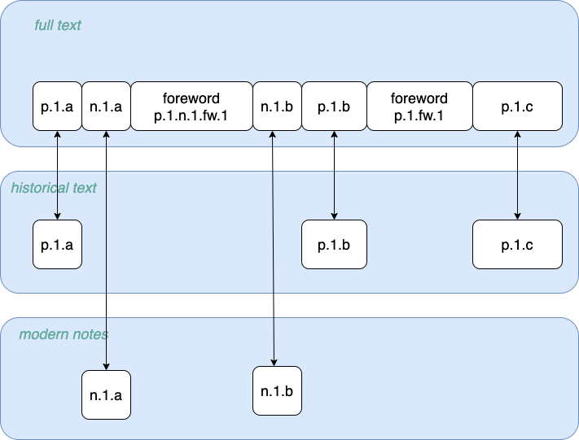

# Functions

File conversion functions are presented here in general, see [Usage](usage.md) for running instructions.

## tei2naf
The conversion of TEI missives into *input* NAF files 
serves to extract project-input files for NLP processing.

The conversion extracts the `<text>` element from TEI files and produces a
NAF file containing the following layers:

* `raw`: the raw text contained in the `<text>` element
* `tunits`: text units corresponding to the `<text>` element and all its sub-elements. 
The text units follow the hierarchical structure of the TEI elements. 

## naf-selector
The derivation of *reference* NAF files from *input* NAF files produces NER-ready files:

* the raw text is selected based on text units to provide *cohesive* and *homogeneous* pieces of text for NER.
* text units are reshaped to provide a non-overlapping sequence of (sub-)units
* the resulting text units are tokenized piece-wise

#### Text cohesion and homogeneity in the missives
The TEI missives closely follow the physical structure of the original volumes. 
The TEI content for a given page typically contains a `<fw>` element (foreword) for page number and
page header, a number of paragraphs and editorial notes, which may appear practically anywhere: at the bottom of pages, but also inline or at the top of the page. 
Both forewords and notes regularly break text sentences, diminishing text cohesion.

Additionally, the original text was written between 1610 and 1760, while the editorial notes date from 1960 onwards ([Huygens KNAW](http://resources.huygens.knaw.nl/vocgeneralemissiven/index_html)). 
The original text therefore exhibits a lot of linguistic variation, but one can roughly distinguish golden-age-Dutch text (titles, headers, and paragraphs) from modern-Dutch text (notes).
  
Reference-NAF derivation consequently allows to select *text-like* or *notes* units and raw text from input NAF files (see [Usage](usage.md)).

As this may change the raw text with regard to the input NAF, and thus character offsets, selected text units are made
to point back to character offsets in the input NAF.

#### Text-unit reshaping
The text units are modified as follows:

* elements that reflect text formatting rather than linguistic units are discarded. This concerns highlighted elements,
 line breaks and page breaks (`<hi>`, `<lb>`, `<pb>`). Note that only the text units are discarded, with no changes for the raw text.
* text units that do not belong to the selected text type are excised, along with the text they cover:
  * for editorial notes (modern Dutch), only `<note>` text units are selected, and embedded `<fw>` are excised.
  * for the original missives text, both `<note>` and `<fw>` elements are excised. 
* the selected text units are flattened to produce a list of non-overlapping text units.  
 
#### Tokenization
The selected text units can be expected to form linguistic units (paragraphs, sentences or phrases). 
However, notes or forewords may interrupt running text, leading to separate text units for a same linguistic unit, as in
the following example:

 
To improve text cohesion, consecutive text units with a same *xpath* are joined for 
tokenization. Note that as a result, text units and paragraphs (as indicated in the tokens `para` field) will not 
always match: the tokenizer may see a given tokenization unit as containing several paragraphs, while 
tokenization units may correspond to several text units. 

## xmi-in2naf
This function inputs manual named-entity annotations in XMI format, matches them to reference NAF files, and 
enriches the NAF files with an entities layer.

The function performs the following operations:
* the raw text in the XMI and the NAF are compared. If they do not match, the character offsets of the input entities are
remapped to the reference raw text.
* entities are mapped to the reference tokens that overlap with their character offsets.
* the reference NAF is enriched with an *entities* layer, which receives the mapped entities.

## naf2conll
The conversion of reference NAF files to Conll simply:
 
* lists tokens (with their sentence identifier) and entities in the NAF file
* derives token-level entity labels 
* prints out each token with its label, separating sentences

As for *Conll2002*, only tokens and entities are output. The NE labelling scheme and separating field can be specified
as options (see [Usage](usage.md)).

## conll-in2naf
The integration of NER entities in Conll format into reference NAF files performs the following operations:

* tokens in the Conll and NAF files are matched to retrieve token identifiers
* token-level entity labels for a same entity are joined
* the reference NAF is enriched with an entities layer (the operation is destructive, as we assume for now that NAF files 
need only be associated with a single, *best* set of entities), and receives entities and their token spans.