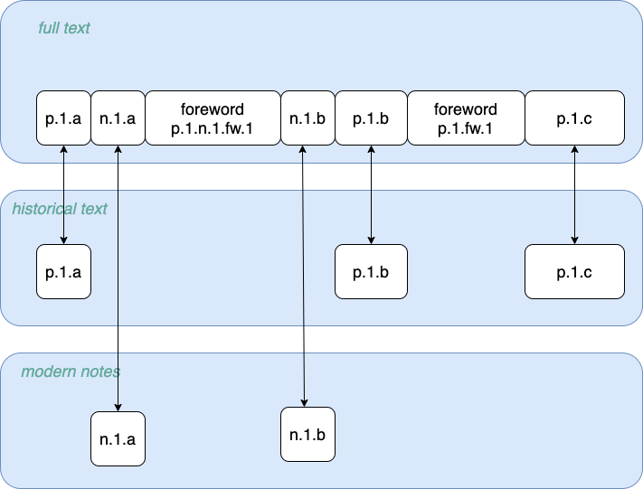

# From TEI to NAF
*(Legacy. Working with TextFabric greatly simplifies working with the letters, notably when it comes to splitting historical 
text from editorial notes. The associated functions and documentation are kept for reference)*

The code generates and manipulates two kinds of NAF files when working with TEI input letters: 

* Input NAF files: these are obtained by conversion from TEI files. These files contain a `raw` text layer, and a `tunits` text-unit layer.
* Derived ('reference') NAF files: these are derived from the input NAF files for further NLP processing. These files contain a 
selection of the input raw text and of the text units, both of which point back to character offsets and xpath in the 
input files. Additionally, the derived NAF files contain a `text` layer for tokens, and an `entities` layer after the 
addition of entities from manual annotations or system output.

Both types of files share a number of layers, but their content differ as explained [below](#differences-between-input-and-reference-naf).


## Splitting text and notes from the TEI
The derivation of *reference* NAF files from *input* NAF files produces NER-ready files, corresponding to either 
the original text or to editor notes. Empty NAF files are created for files that do not contain matching units.  

* the raw text is selected based on text units (text-like, notes or all) to provide *cohesive* and *homogeneous* pieces of text for NER.
* text units are reshaped to provide a non-overlapping sequence of (sub-)units
* the resulting text units are tokenized piece-wise

#### Text cohesion and homogeneity in the missives
The TEI files closely follow the physical structure of the original volumes. 
The TEI content for a given page typically contains a `<fw>` element (foreword) for page number and
page header, a number of paragraphs and editorial notes, which may appear practically anywhere: at the bottom of pages, but also inline or at the top of the page. 
Both forewords and notes regularly break text sentences, diminishing text cohesion.

Additionally, the letters contain both historical text and editorial notes, which we want to keep separate for NER.
 
Reference-NAF derivation consequently allows to select *text-like* or *notes* units and raw text from input NAF files (see [Usage](usage.md)).

As this may change the raw text with regard to the input NAF, and thus character offsets, selected text units are made
to point back to character offsets in the input NAF.

#### Text-unit reshaping
The text units are modified as follows:

* elements that reflect text formatting rather than linguistic units are discarded. This concerns highlighted elements,
 line breaks and page breaks (`<hi>`, `<lb>`, `<pb>`). Note that only the text units are discarded, with no changes for the raw text.
* text units that do not belong to the selected text type are excised, along with the text they cover:
  * for editorial notes (modern Dutch), only `<note>` text units are selected, and embedded `<fw>` are excised.
  * for the original missives text, both `<note>` and `<fw>` elements are excised. 
* the selected text units are flattened to produce a list of non-overlapping text units.  
 
#### Tokenization
The selected text units can be expected to form linguistic units (paragraphs, sentences or phrases). 
However, notes or forewords may interrupt running text, leading to separate text units for a same linguistic unit, as in
the following example:


 
To improve text cohesion, consecutive text units with a same *xpath* are joined for 
tokenization. Note that as a result, text units and paragraphs (as indicated in the tokens `para` field) will not 
always match: the tokenizer may see a given tokenization unit as containing several paragraphs, while 
tokenization units may correspond to several text units. 

## Differences between input and reference NAF
### Header
The linguistic-processors list of the reference NAF is extended with a reference to `naf-selector` for all layers.

Besides, the filename is extended with `-text`, `-notes` or , `-all` depending on the document-type selection.

### Raw layer
#### Input NAF
The raw text contains the yield of the `<text>` element of the input TEI.

#### Reference NAF
The raw text is a selection of the input raw text, based on selection of `tunit` elements from the input TEI.
Three selections can be made:

* `text`: this excludes `note` and `fw` tunits
* `notes`: this selects `note` tunits, excluding embedded `fw` tunits
* `all`: this keeps the same raw text as the input NAF's   

### Tunits layer
#### Input NAF
Tunits correspond one-to-one to TEI elements. Consequently:
 
* they contain zero-length elements (line breaks `<lb>` and page breaks `<pb>`), as well as text-formatting elements (highlighting `<hi>`). 
Zero-length elements are given the character offset of the following character (if they appear at the end of a document, 
their character offset will consequently *fall off* the document); 
* they are structured hierarchically (as a tree), and listed in prefix order.

#### Reference NAF
Tunits are filtered and adapted for NLP processing (notably tokenization):

* zero-length and text-formatting tunits are removed; 
* tunits are flattened to form a list of non-overlapping tunits; 
* additionally, a selection of notes or text may be performed on the tunits. As this alters the raw text,  
the character offsets of flattened tunit fragments are
appended to the tunit `id` to provide a reference to the input NAF raw text. 

In the following example, tunits have been flattened, resulting in two separate fragments for the paragraph `(..).p.2`.
The character offsets of each tunit are appended to its `id` to keep a reference to the input NAF raw text.
```xml
    <tunit
        id="INT_0aff566f-8c02-332d-971d-eb572c33f86b.TEI.1.text.1.body.1.div.1.p.2.co419-230"
        type="p" xpath="/TEI/text[1]/body[1]/div[1]/p[2]"
        offset="419" length="230"/>
    <tunit
        id="INT_0aff566f-8c02-332d-971d-eb572c33f86b.TEI.1.text.1.body.1.div.1.p.2.note.1.co649-25"
        type="note" xpath="/TEI/text[1]/body[1]/div[1]/p[2]/note[1]"
        offset="649" length="25"/>
    <tunit
        id="INT_0aff566f-8c02-332d-971d-eb572c33f86b.TEI.1.text.1.body.1.div.1.p.2.note.2.co674-47"
        type="note" xpath="/TEI/text[1]/body[1]/div[1]/p[2]/note[2]"
        offset="674" length="47"/>
    <tunit
        id="INT_0aff566f-8c02-332d-971d-eb572c33f86b.TEI.1.text.1.body.1.div.1.p.2.fw.1.co721-512"
        type="fw" xpath="/TEI/text[1]/body[1]/div[1]/p[2]/fw[1]"
        offset="721" length="512"/>
    <tunit
        id="INT_0aff566f-8c02-332d-971d-eb572c33f86b.TEI.1.text.1.body.1.div.1.p.2.co1233-26"
        type="p" xpath="/TEI/text[1]/body[1]/div[1]/p[2]"
        offset="1233" length="26"/>
```

Selecting notes leads to a reduced list of tunits, and a shorter raw text; character offsets change as a result, but the 
original offsets are preserved in the tunit `id`:

```xml
    <tunit
        id="INT_0aff566f-8c02-332d-971d-eb572c33f86b.TEI.1.text.1.body.1.div.1.p.2.note.1.co649-25"
        type="note" xpath="/TEI/text[1]/body[1]/div[1]/p[2]/note[1]"
        offset="154" length="25"/>
    <tunit
        id="INT_0aff566f-8c02-332d-971d-eb572c33f86b.TEI.1.text.1.body.1.div.1.p.2.note.2.co674-47"
        type="note" xpath="/TEI/text[1]/body[1]/div[1]/p[2]/note[2]"
        offset="179" length="47"/>
```
